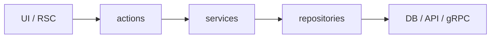

<div align="center">

<p align="center">
  <sub><strong>AGENT SKILL</strong> · <code>nextarch</code> · APP ROUTER</sub>
</p>

<p align="center">
  <picture>
    <source media="(prefers-color-scheme: dark)" srcset="./assets/nextarch-wordmark-dark.png" />
    
  </picture>
</p>

<p align="center">
  
</p>

<p align="center">
  <a href="https://agentskills.io"></a>
  &nbsp;
  <a href="https://github.com/vercel-labs/skills"></a>
  &nbsp;
  
  &nbsp;
  
  &nbsp;
  
  &nbsp;
  <a href="LICENSE"></a>
</p>

<p align="center">
  <a href="#install"><strong>Install</strong></a>
  &nbsp;·&nbsp;
  <a href="#quick-start"><strong>Quick start</strong></a>
  &nbsp;·&nbsp;
  <a href="#when-to-use"><strong>When to use</strong></a>
  &nbsp;·&nbsp;
  <a href="#example-prompts"><strong>Examples</strong></a>
  &nbsp;·&nbsp;
  <a href="#contributing"><strong>Contributing</strong></a>
</p>

<p align="center">
  <code>npx skills add sameer2006-s/NextArch --skill nextarch</code>
</p>

<p align="center">
  <sub>Node.js 18+ · <a href="https://cursor.com">Cursor</a> · <a href="https://code.claude.com">Claude Code</a> · <a href="https://developers.openai.com/codex">Codex</a> · <a href="https://windsurf.com">Windsurf</a> · <a href="https://github.com/vercel-labs/skills#supported-agents">50+ agents</a></sub>
</p>

</div>

---

An [Agent Skills](https://agentskills.io) package that keeps Next.js App Router code **consistent and scalable**: server-first loading, minimal client islands, and clear boundaries for integrated DB, REST, or Connect/gRPC backends. Opinionated about dependency direction, but **adaptable to brownfield folder structure** via task scope and escape hatches.

**Repo:** [sameer2006-s/NextArch](https://github.com/sameer2006-s/NextArch)

## Why NextArch

Agents often scatter `useEffect` fetches, mix DB calls into components, or invent a new folder scheme on every task. NextArch gives a repeatable playbook:

| You get | How |
|--------|-----|
| **Predictable layers** | UI → actions → services → repositories → DB / REST / gRPC |
| **Server-first defaults** | RSC for reads; `"use client"` only at leaves |
| **Right-sized planning** | Patch / Feature / Greenfield scope before code |
| **Brownfield-safe** | Match `features/`, `src/modules/`, or route colocation first |
| **Backend flexibility** | Integrated (Prisma/Drizzle), Separate-REST, Separate-gRPC, or Hybrid |

The agent loads a compact [`SKILL.md`](skills/nextarch/SKILL.md) up front and pulls [`rules/`](skills/nextarch/rules/) and [`docs/`](skills/nextarch/docs/) only when the task needs them.

## Install

```bash
npx skills add sameer2006-s/NextArch --skill nextarch
```

| Goal | Command |
|------|---------|
| This repo only | `npx skills add sameer2006-s/NextArch --skill nextarch -y` |
| All projects | `npx skills add sameer2006-s/NextArch --skill nextarch -g -y` |
| Preview skills | `npx skills add sameer2006-s/NextArch --list` |
| One agent | `npx skills add sameer2006-s/NextArch --skill nextarch -a <agent> -y` |

**Requires:** Node.js 18+ and a skills-capable agent.

<details>
<summary><strong>Clone and install from source</strong></summary>

```bash
git clone https://github.com/sameer2006-s/NextArch.git
cd NextArch
npx skills add . --skill nextarch -y
```

</details>

## Quick start

1. Enable the **`nextarch`** skill in your agent.
2. Start prompts with **`Using nextarch,`** or **`Using NextArch,`**.
3. The agent classifies scope, detects backend topology, prints a short plan, then implements.

```text
Using nextarch, add a comments feature with Prisma: list and create on a post.
```

## When to use

| Use NextArch when… | Skip when… |
|--------------------|------------|
| Moving server-loadable data out of client components | Styling, copy, or isolated UI tweaks |
| Adding or refactoring a feature / domain slice | One-line bugfixes with no boundary change |
| Wiring Server Actions, services, repositories | Middleware-only with no data/structure impact |
| Choosing Prisma, Drizzle, REST, or Connect/gRPC layers | Pages Router–only or non-Next.js work |
| Refactoring `useEffect` + fetch dashboards | tRPC/GraphQL procedure-only tasks (boundaries only—see escape hatches) |

## How it works

### Task scope

The agent picks how much planning to emit before coding:

| Scope | When | Planning output |
|-------|------|-----------------|
| **Patch** | Single file, tiny fix | `## Plan` (2–4 bullets) |
| **Feature** | One slice or area (default) | `## Topology`, `## Architecture`, `## Data flow` |
| **Greenfield** | Multi-feature or new app area | Above + rendering / performance notes |

### Data flow



- **Reads:** Server Component → service → repository / RPC client  
- **Writes:** Client island → Server Action (Zod) → service → repository / RPC → revalidate  

### Backend topologies

| Mode | Signals | Domain rules live in |
|------|---------|----------------------|
| **Integrated** | Prisma, Drizzle, `lib/db` | Next.js `services/` |
| **Separate-REST** | `API_URL`, external `fetch` | Backend |
| **Separate-gRPC** | Connect, protobuf clients | Backend |
| **Hybrid** | Mixed per feature | One transport per feature |

Details: [`skills/nextarch/docs/topology.md`](skills/nextarch/docs/topology.md) · Brownfield: [`docs/brownfield.md`](skills/nextarch/docs/brownfield.md) · tRPC/GraphQL: [`docs/escape-hatches.md`](skills/nextarch/docs/escape-hatches.md)

## Example prompts

**Integrated feature**

```text
Using nextarch, add comments on a post: list and create. We use Prisma.
```

**Connect / gRPC with client refresh**

```text
Using nextarch, add an item detail page with optional client refresh.
Connect RPC; proto package @acme/api.
```

**Refactor client-heavy page**

```text
Using nextarch, refactor app/dashboard/page.tsx — "use client" and useEffect fetch.
Move to a server-first feature slice; keep our src/modules/ layout.
```

## Repository layout

```
nextarch-skill-repo/
├── assets/                   # README wordmark PNGs
├── package.json              # skill:check, skill:scaffold, skill:workspace
├── scripts/
│   ├── skill-check.mjs       # CI validators
│   └── scaffold-feature.mjs
├── .github/workflows/        # skill-check on PR
└── skills/nextarch/
    ├── SKILL.md              # agent entry (loaded first)
    ├── skill.json            # version + lazyDocs manifest
    ├── rules/                # architecture, folders, coding standards
    ├── docs/                 # brownfield, topology, snippets, testing
    └── evals/                # behavioral + trigger evals
```

Browse on-demand docs: [`skills/nextarch/docs/README.md`](skills/nextarch/docs/README.md)

## Migrating from `nextjs-feature-architecture`

The skill id is **`nextarch`** (v1.7+). Remove the old install, then:

```bash
npx skills add sameer2006-s/NextArch --skill nextarch -y
```

Use `Using nextarch, …` in prompts (or `Using NextArch, …`).

## Contributing

PRs welcome. Keep each `SKILL.md` under ~165 lines; run checks before opening a PR.

```bash
npm run skill:check          # package, links, lazyDocs, evals (CI runs this)
npm run skill:scaffold -- comments   # optional feature folder template
npm run skill:workspace      # scaffold agent benchmark workspace
```

| Resource | Link |
|----------|------|
| Changelog | [CHANGELOG.md](CHANGELOG.md) |
| Maintainer guide | [PUBLISHING.md](PUBLISHING.md) |
| Evals & release gates | [skills/nextarch/evals/README.md](skills/nextarch/evals/README.md) |
| License | [MIT](LICENSE) |
